# Exercise 1: Authoring Your First Page

**Duration**: 20 minutes

---

<details>
<summary><strong>Quick navigation</strong></summary>

- [Prerequisites](#prerequisites)
- **Background** (please read — expand the section below, or jump: [What you'll learn](#what-youll-learn) · [Experience Workspace & tables → blocks](#experience-workspace-the-authoring-tool) · [Before you start](#before-you-start))
- **Exercise steps**
  - [Step 1: Create Your Page](#step-1-create-your-page)
  - [Step 2: Start From a Template](#step-2-start-from-a-template)
  - [Step 3: Update Your Content](#step-3-update-your-content)
  - [Step 4: Update Metadata](#step-4-update-metadata)
  - [Step 5: Add and Resolve Comments](#step-5-add-and-resolve-comments)
  - [Step 6: Explore Prepare Menu (Preflight)](#step-6-explore-prepare-menu-preflight)
  - [Step 7: Preview](#step-7-preview)
  - [Step 8: Inspect the Content Transformation](#step-8-inspect-the-content-transformation)
  - [Step 9: Publish](#step-9-publish)
- [Verification Checklist](#verification-checklist)
- [References](#references)
- [Next Exercise](#next-exercise)

</details>

---

## Prerequisites

**Complete [SETUP.md](../SETUP.md) before starting this exercise.** Exercises can be done in sequence or independently; if independent, ensure SETUP is done and you have the items below.

**Required:**
- Verify the local dev server is accessible at [http://localhost:3000](http://localhost:3000); if not, start it with `aem up` from the project root in a terminal ([SETUP Step 6](../SETUP.md#step-6-start-development-server)).
- Experience Workspace access verified: [da.live/#/edsmasterclass/labs](https://da.live/#/edsmasterclass/labs)
- Personal folder exists at `/drafts/<your-name>/` (first initial + last name, all lowercase — e.g. John Smith → `jsmith`)
- AEM Sidekick installed and this project added — toolbar is visible when you open `localhost:3000`

> **If your `/drafts/<your-name>/` folder is missing:** create it first and favorite it in Experience Workspace (see [SETUP Step 9](../SETUP.md#step-9-verify-experience-workspace-access)), then return to this exercise.

> **Your personal `<your-name>--labs--edsmasterclass.aem.page` URL does not exist yet.**
> It becomes active only after your first `git push` in Exercise 2.
> In this exercise, use `localhost:3000` and the `main--` URLs shown below.

---

<details>
<summary><strong>Background</strong> (please read — concepts & warm-up before the hands-on steps)</summary>

## What You'll Learn

- How to author content in **Experience Workspace** — the browser-based editor purpose-built for EDS
- How a table in Experience Workspace becomes a decorated block on the rendered page
- How **Preview** and **Publish** update `.aem.page` and `.aem.live` respectively
- How to inspect your content at each transformation stage: document source, `.md`, `.plain.html`

---

## Experience Workspace: The Authoring Tool

This lab uses **Experience Workspace** — a purpose-built, browser-based document editor for EDS. It is not Google Docs, Microsoft Word, or SharePoint. Experience Workspace gives authors a familiar word-processor experience in the browser, but the underlying format is clean semantic HTML.

**The key pattern — tables become blocks:**

A table authored in Experience Workspace:

```
| Hero                   |
|------------------------|
| Welcome to Masterclass |
```

Becomes this HTML after EDS processes it:

```html
<div class="hero">
  <div><div>Welcome to Masterclass</div></div>
</div>
```

The table header (`Hero`) becomes the CSS class. Developers write `blocks/hero/hero.js` and `blocks/hero/hero.css` to decorate it. Authors never write CSS class names — the table structure *is* the contract between author and developer.

**The content pipeline:**

```
Experience Workspace editor
     │
     │  Save
     ▼
Preview (.aem.page) ── code from main GitHub branch
     │                  content from Experience Workspace
     │  Publish
     ▼
Live (.aem.live) ──── same code, same content (promoted to production)
```

For a full overview of Experience Workspace authoring: [aem.live/docs/ew/authoring](https://www.aem.live/docs/ew/authoring)

---

## Before You Start

Spend 2 minutes reviewing an existing page before creating your own. Open these side-by-side:

- **In Experience Workspace** (author's view): [sessions/architecture-deep-dive](https://da.live/edit#/edsmasterclass/labs/sessions/architecture-deep-dive)
- **Rendered** (visitor's view): [localhost:3000/sessions/architecture-deep-dive](http://localhost:3000/sessions/architecture-deep-dive)

Notice how the tables you see in Experience Workspace become the styled components on the rendered page. That transformation is what this exercise is about.

</details>

---

## Step 1: Create Your Page

1. Go to [da.live/#/edsmasterclass/labs](https://da.live/#/edsmasterclass/labs)
2. Navigate into `/drafts/<your-name>/`
3. Click **New** → **Document**
4. Name it `my-session` or `my-lab`

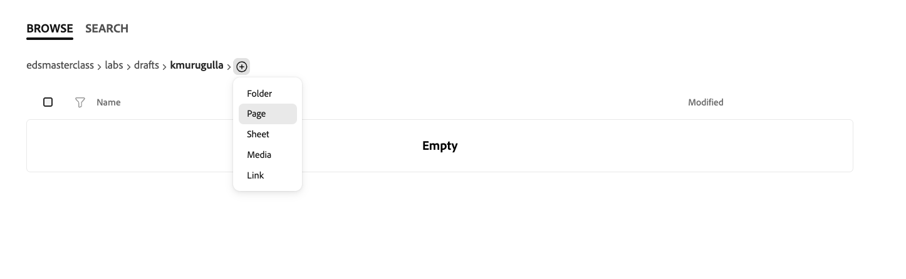

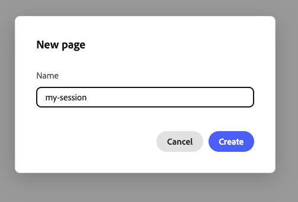

After the page opens, quickly orient yourself:
- **Left panel**: Assistant/chat panel
- **Center**: Editor with **Layout**, **Content**, and **Side-by-side** modes
- **Right panel**: **Outline** view for sections

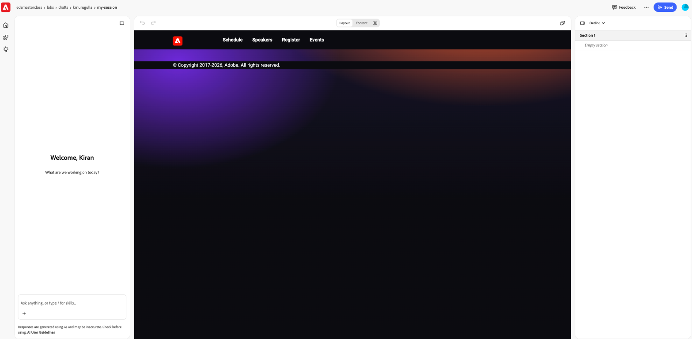

---

## Step 2: Start From a Template

Experience Workspace provides **session** and **lab** templates for this project. Using a template inserts all the required blocks and sections pre-populated with placeholder content — you fill in the details rather than building from scratch.

In the page editor:

1. In the right panel, keep the mode on **Outline** and open the mode dropdown.
2. Select **Templates**.

   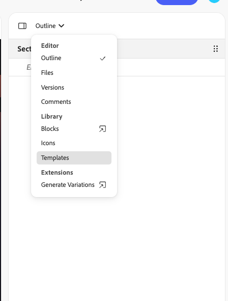

> **If you do not see Templates or Blocks in the panel**, your account may not have library access in Experience Workspace yet. **@mention your instructor in the lab Slack channel** and include your **Adobe ID email** (the one you used on the [lab access form](https://main--aem-rockstar-website--adobe.aem.page/en/masterclass/eds-labs-access-request)) so they can verify or fix permissions. Confirm you submitted that form with the **same** Adobe ID and GitHub username you use in the lab — see [SETUP.md — Step 9: Verify Experience Workspace Access](../SETUP.md#step-9-verify-experience-workspace-access).

3. In the templates list, you should see both **Session Template** and **Lab Template**.
4. Optional: click the **first preview icon** next to a template to preview it before inserting.

   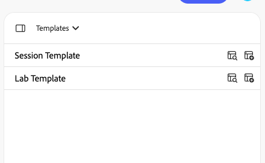

5. Choose the template you want and insert it into your page.

The template inserts a Hero block, content sections, and a Metadata block — all with placeholder text.

  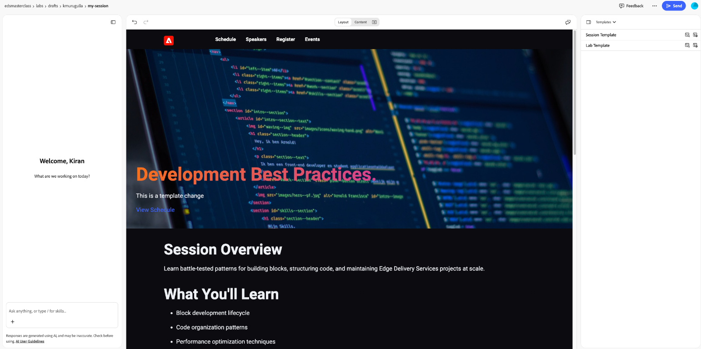

> **Tip:** Switch to **Content** mode to inspect the underlying structure (block tables and section layout) before you start editing. You can also use **Side-by-side** mode to compare rendered output and underlying content at the same time.
>
> 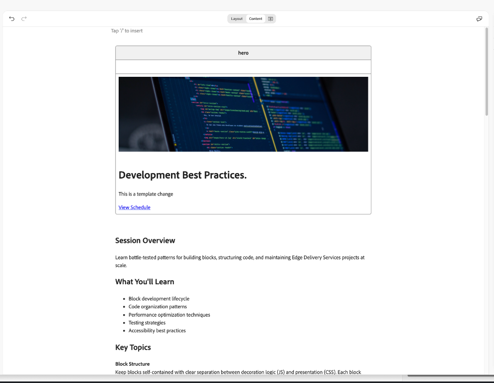
>
> 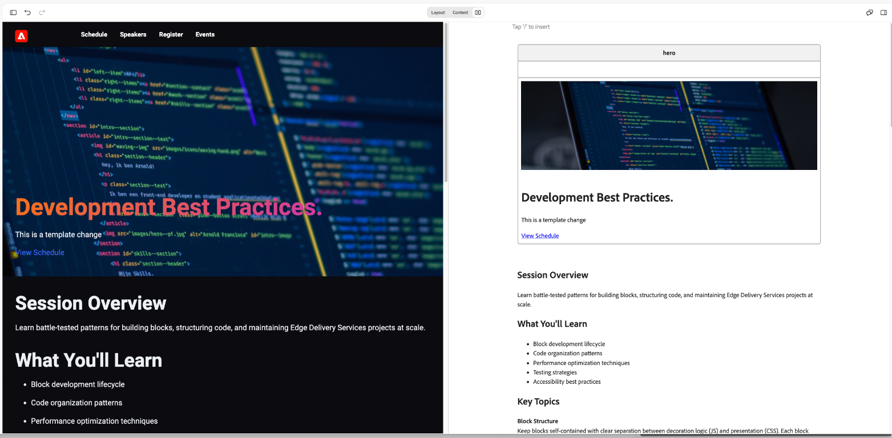

---

## Step 3: Update Your Content

With the template inserted, replace each placeholder **in Experience Workspace**. Do not paste Markdown tables or `##` lines from this page; edit directly in the editor.

Choose whichever editing mode works best for you:
- **Layout mode**: A what-you-see-is-what-you-get view for editing against the rendered page.
- **Content mode**: Document mode for editing underlying content structure (tables/blocks, text, links, and formatting).
- **Side-by-side mode (recommended)**: See rendered output and underlying content together while you edit.

The video below demonstrates these editing options and a sample content update flow. Use it as a guide, then explore the modes on your own.

**Content sections** (below the Hero — headings and bullets already come from the template):

1. Find the **Session Overview** heading. Under it, replace the placeholder with two or three sentences describing your session or lab.
2. Find the **What You'll Learn** heading. Replace the three placeholder bullets with your own learning objectives (edit each list item in place).

> **Tip**: Type `/` anywhere in the document to explore other available insert options such as headings, images, links, and dividers.

**Editing walkthrough video**:

<video controls width="960" src="images/editing-content-walkthrough-bengaluru-v2.mp4"></video>

---

## Step 4: Update Metadata

The template includes a Metadata block at the bottom of the page. Fill in the placeholder values **in the table cells in Experience Workspace** (edit each cell like normal text). **It must remain the last element on the page.**

**For a session**, update these rows (names are in the first column, your values in the second):

- **Title** — your session title, then ` - EDS Masterclass Labs` (or follow the template wording).
- **Description** — a short description for SEO.
- **speaker-name** — speaker name.
- **category** — e.g. `technical` (or another value your template suggests).
- **session-level** — one of `beginner`, `intermediate`, or `advanced`.

**For a lab**, update these rows:

- **Title** — `Lab: ` plus your lab title and ` - EDS Masterclass Labs` (or follow the template).
- **Description** — a short description for SEO.
- **instructor-name** — instructor name.
- **category** — e.g. `development`, `authoring`, or `configuration` as appropriate.
- **difficulty** — one of `beginner`, `intermediate`, or `advanced`.

## Step 5: Add and Resolve Comments

Use comments to practice review and collaboration inside the editor:

1. Select the **Session Title** text and click the **Comment** action.

   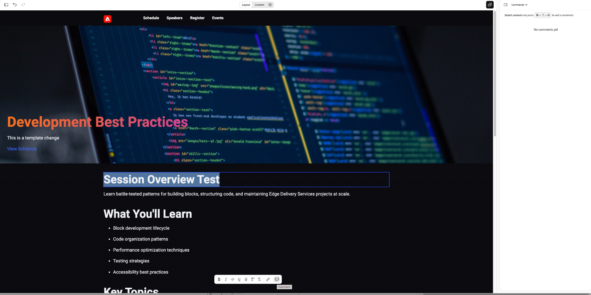

2. Add a real reviewer comment (for example, request a title change) and post it.

   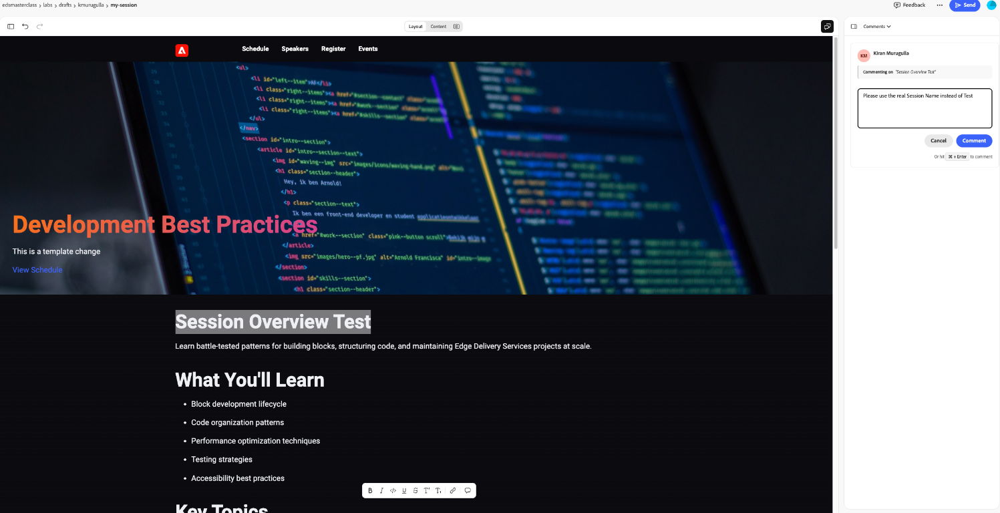

3. Address the reviewer comment by updating the content and replying in the thread.

   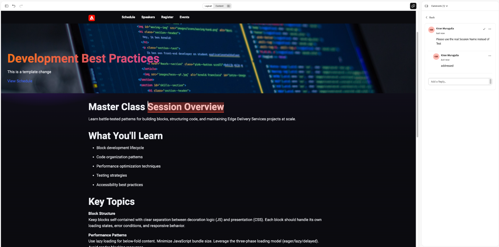

4. Open the thread actions menu to review available options (edit/delete thread/link to comment).

   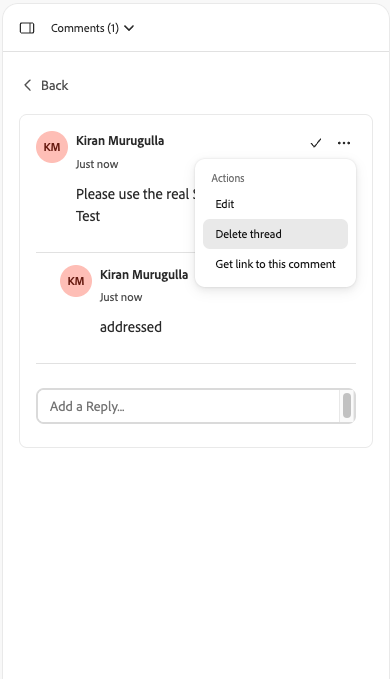

---

## Step 6: Explore Prepare Menu (Preflight)

Before previewing, open the prepare menu and review preflight options:

1. In the top-right corner, open the **more** menu (`...`) next to **Send**.
2. Click **Preflight** to explore validation checks available before Preview/Publish.

   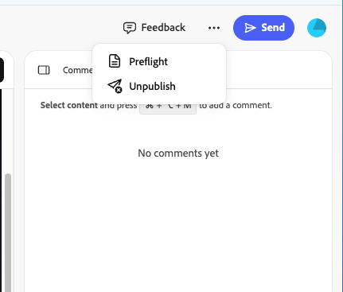

---

## Step 7: Preview

1. In the top-right corner, open **Send** and choose **Preview**.

   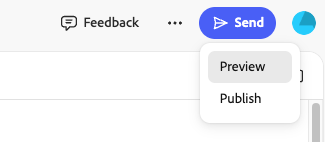

Your page is now available at:

**Local** — uses your local code files + Experience Workspace content:
```
http://localhost:3000/drafts/<your-name>/my-session
```

**Main preview** — uses main branch code + Experience Workspace content, accessible without a running dev server:
```
https://main--labs--edsmasterclass.aem.page/drafts/<your-name>/my-session
```

> **Note**: There is no `<your-name>--` preview URL yet. That becomes available after `git push origin <your-name>` in Exercise 2. Until then, `localhost:3000` is your working environment.

Open your page on `localhost:3000`. Compare it against the reference live site:
[main--labs--edsmasterclass.aem.live](https://main--labs--edsmasterclass.aem.live/)

---

## Step 8: Inspect the Content Transformation

This is the core learning step. Your page exists in multiple representations simultaneously. Follow the order below: document source (author HTML), then **`.md`** (storage view), then **`.plain.html`** (EDS block HTML before browser decoration).

### Document Source — what the author wrote

With your page open at `http://localhost:3000/drafts/<your-name>/my-session`, use either path below to open **View document source**:

**Option 1 — Sidekick on the page:** When the Sidekick toolbar is visible on the page, use it and choose **View document source**.


**Option 2 — Extensions menu (Chrome / Edge):** If the on-page Sidekick toolbar is not showing, click the **Extensions** icon (puzzle piece) in the browser toolbar → in the list, find **AEM Sidekick** → click the **⋮** (More actions) next to it → **View document source**.

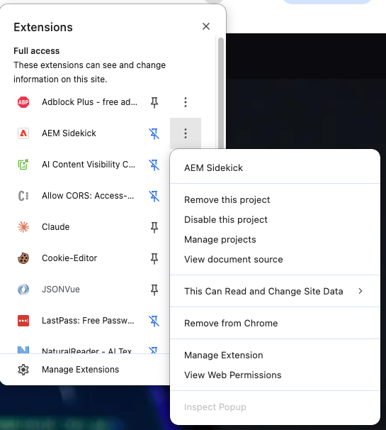

**What you see**: Raw HTML from Experience Workspace — tables are still `<table>` elements, no `class="hero"`, no block structure. This is exactly what the author wrote.

---

### `.md` — the content as Markdown

Open in a new tab. Available on both local and the main preview environment:

```
http://localhost:3000/drafts/<your-name>/my-session.md
https://main--labs--edsmasterclass.aem.page/drafts/<your-name>/my-session.md
```

**What you see**: Your content as Markdown — tables, headings, and lists in plain text format. This is the storage format EDS uses internally.

---

### `.plain.html` — what EDS processes

Next, open **`.plain.html`** in a new tab (same environments as above):

```
http://localhost:3000/drafts/<your-name>/my-session.plain.html
https://main--labs--edsmasterclass.aem.page/drafts/<your-name>/my-session.plain.html
```

**What you see**: EDS has transformed your Hero table into block divs:

```html
<div class="hero">
  <div><div>Your Session Title</div></div>
  <div><div><a href="...">View Schedule</a></div></div>
</div>
```

The Metadata table is gone — EDS has processed it into `<head>` tags. This `.plain.html` is what JavaScript receives when `decorate(block)` is called.

---

### The transformation at a glance

| What you open | What it shows |
|---|---|
| Document Source (Sidekick) | Raw Experience Workspace HTML — what the author wrote, unprocessed |
| `…/my-session.md` | Markdown — the storage format |
| `…/my-session.plain.html` | EDS-processed HTML — tables become `<div class="blockname">`, Metadata → `<head>` |
| `localhost:3000/…` | Fully rendered page — `.plain.html` decorated by JavaScript and CSS |

---

## Step 9: Publish

Your content moves from preview (`.aem.page`) to production (`.aem.live`). Use **either** path below.

**Option 1 — From Experience Workspace:** In the top-right corner, open **Send**, choose **Publish**, and wait for the confirmation banner.

**Option 2 — From AEM Sidekick while previewing on `.aem.page`:**

1. Open your page in the browser so the URL is on **`.aem.page`** — for example:  
   `https://main--labs--edsmasterclass.aem.page/drafts/<your-name>/my-session` (same pattern as in Step 7; replace `<your-name>`).
2. With **AEM Sidekick** visible on that tab, use **Publish** and complete the flow.
3. **Observe the URL:** after a successful publish, the address should switch from **`.aem.page`** to **`.aem.live`** for the same content path.
4. **Observe Sidekick:** toolbar options and actions often **differ** between preview (`.aem.page`) and live (`.aem.live`) — note what changed after publish.

Your page is now on the **live** environment. Verify all three representations are accessible:

```
https://main--labs--edsmasterclass.aem.live/drafts/<your-name>/my-session
https://main--labs--edsmasterclass.aem.live/drafts/<your-name>/my-session.md
https://main--labs--edsmasterclass.aem.live/drafts/<your-name>/my-session.plain.html
```

**What happened**: The EDS Admin API promoted your content from `.aem.page` (preview) to `.aem.live` (production). The `.plain.html` and `.md` are identical across both environments — the only difference is *when* content appears: after Preview vs. after Publish.

> **When does your `<your-name>--` live URL appear?**
> `https://<your-name>--labs--edsmasterclass.aem.live/...` becomes active after you push your feature branch in Exercise 2. Content on `.aem.live` is the same regardless of branch — only the *code* (blocks, scripts, styles) differs between `main--` and `<your-name>--`.

---

## Verification Checklist

**Authoring complete**
- [ ] Page created in Experience Workspace under `/drafts/<your-name>/`
- [ ] Template inserted (Session or Lab) and edited with your own content
- [ ] Metadata updated and kept as the last element on the page

**Collaboration and preflight complete**
- [ ] Comment thread created, content updated, and response added in the thread
- [ ] Preflight opened from the `...` menu and reviewed before preview

**Delivery and inspection complete**
- [ ] Page visible at `http://localhost:3000/drafts/<your-name>/my-session`
- [ ] Preview completed from **Send → Preview**
- [ ] Publish completed from **Send → Publish** (or Sidekick on `.aem.page`)
- [ ] **Document source** viewed via Sidekick — tables visible, no `class="hero"`
- [ ] **`.md`** opened on `localhost:3000` (and optionally on `main--`) — content confirmed
- [ ] **`.plain.html`** opened on `localhost:3000` and on `main--labs--edsmasterclass.aem.page` — matches expected block structure
- [ ] All three representations accessible on `main--labs--edsmasterclass.aem.live`

---

## References

- [Experience Workspace Authoring](https://www.aem.live/docs/ew/authoring)
- [AEM Sidekick](https://www.aem.live/docs/sidekick)
- [Markup, Sections, Blocks](https://www.aem.live/developer/markup-sections-blocks)

---

## Next Exercise

**Exercise 2**: Block Development — You'll read the existing `blocks/cards/cards.js` to understand how EDS transforms the `.plain.html` you just inspected into styled, interactive components. Then you'll create test content in Experience Workspace and push your first commit — which is also when your personal `<your-name>--` preview URL comes to life.
